# Projet Groupe

Auteurs : David Paulino, Florent Beney
Créé le : November 18, 2022 4:34 PM

# Résumé du document

Ce projet vise à analyser les données de crimes obtenues via l'API Police UK afin de déterminer des tendances et des conclusions sur les crimes qui ont été commis au Royaume-Uni. Les étapes entreprises pour mener à bien ce projet comprennent l'installation de HDP sur des machines personnelles, l'utilisation de PySpark pour prendre en main les différentes commandes, l'utilisation de l'exemple Twitter pour avoir une bonne base et l'installation de Flume et Hive pour le traitement des données.

# Objectif du projet

Le but de ce projet est d'analyser les données de crimes obtenues via l'API Police UK afin de déterminer des tendances et des conclusions sur les crimes qui ont été commis au Royaume-Uni. L’intérêt d’analyser ces données serait d’observer les nombres de crimes commis par mois, la répartition du type de crimes, par commissariat.

# Logbook

Dans cette partie du document, nous allons essayer d'expliquer le déroulement des étapes que nous avons entreprises dans ce cours afin de mener à bien notre projet. Pour rappel, nous devions présenter notre idée de projet le 23 novembre, on peut donc dire qu'on a commencé à travailler sur ce projet à partir de ce moment.

## **Installation de HDP**

Pour notre projet, la 1ère étape fut d'installer HDP sur nos machines personnelles. Pour ce faire, nous l'avons téléchargé [ici](https://www.cloudera.com/downloads/hortonworks-sandbox/hdp.html) et avons suivi [ce tutoriel](https://www.cloudera.com/tutorials/sandbox-deployment-and-install-guide/1.html).

### **Florent**

Florent a commencé par télécharger et installer HDP sur Docker, étant donné que c'était une des propositions. Après avoir téléchargé les 22 GB et procédé à l'installation, HDP ne fonctionnait pas, et monsieur Behfar nous a informé que l'installation sur Docker sur Mac ne fonctionnait pas.

Il a donc téléchargé à nouveau sur VirtualBox. L'installation s'est déroulé correctement, mais HDP était horriblement lent. Après avoir de nouveau regardé le tutoriel, il a constaté la chose suivante :


Il faut allouer ***au minimum*** 10 GB de RAM pour la machine virtuelle. C'est vrai qu'on a tous des machines dotées d'autant de RAM. Comme mon Mac a seulement 8 GB, la machine virtuelle ne pouvait tourner correctement.

Il a donc essayé sur son vieil ordi Windows, doté de 16 GB de RAM, mais malheureusement la machine ne tournait pas beaucoup mieux.

### **David**

Étant sur un MacBook Air doté d'une puce M1 avec architecture ARM, David a eu des problèmes pour faire tourner HDP, étant donné qu'il fallait une VM et que les propositions de Cloudera (VMware et VirtualBox) ne sont pas compatibles avec les puces ARM. De plus, comme vu précédemment, Docker sur Mac n'était pas compatible, il se retrouvait donc dans une impasse. Il a donc recherché des solutions et il a trouvé une solution qui consistait à convertir le fichier VirtualBox en fichier utilisable par UTM (seul outil de virtualisation open-source et compatible avec M1). Il l’a communiqué à M. Behfar qui lui a déconseillé d’opter pour cette solution car il ne connaissait pas UTM et donc qu’il y aurait des risques d’incomptabilité après conversion du fichier.

### **Solution : VM Azure**

Le 1er décembre, soit 1 semaine après la présentation de notre projet, ni David ni Florent n'avaient d'installation de HDP fonctionnelles. Nous avons donc demandé des VM Azure à monsieur Behfar. Après avoir réussi à se connecter, nous avions enfin accès à une installation fonctionnelle de HDP.

## **PySpark**

Nous avons fait l'exercice [Exercise with Lambda in PySpark](https://cyberlearn.hes-so.ch/pluginfile.php/4175398/mod_resource/content/1/Exercise%20with%20Lambda%20in%20PySpark.pdf) sur HDP, afin de prendre en main les différentes commandes. Rapidement, on s'est rendu compte qu'on était sur la même machine virtuelle, et donc que les modifications faites par l'un dans le cluster étaient aussi accessible par l'autre. Dans ce cas, on ne pouvait pas vraiment travailler à 2, étant donné que nous étions sur le même environnement.

## **1er essai : Twitter example**

Pour commencer, nous avons essayé de faire tourner le [CDH Twitter example](https://github.com/cloudera/cdh-twitter-example), afin d'avoir une bonne base sur laquelle démarrer. Pour ce faire, nous avons donc suivi ce que disait le README.

### **Installation de Flume**

La 1ère étape fut d'installer Flume. Pour ce faire, il fallait `maven`, qui n'était pas installé sur HDP. Florent a donc fait les différentes étapes pour installer la bonne version de Java et celle de `maven` (qui n'étaient pas les dernières versions, étant donné que l'exemple Twitter date d'au moins 6 ans).

Ensuite, il fallait modifier le fichier `flume.conf` depuis l'interface Ambari. Étant connecté avec l'utilisateur `maria_dev`, Florent n'avait pas les droits pour modifier ce fichier, il devait donc se connecter en administrateur. Cependant, il n'avait pas le mot de passe de ce dernier; il a trouvé dans [l'exemple d'utilisation d'Apache Kafka](https://cyberlearn.hes-so.ch/pluginfile.php/4171328/mod_resource/content/1/Exercise%20with%20Apache%20Kafka.pdf) la commande `ambari-admin-password-reset`, qui permet de réinitialiser le mot de passe du compte administrateur d'Ambari. Après avoir lancé cette commande, le serveur ne voulait pas redémarrer correctement, et donc l'accès à Ambari était impossible. Monsieur Behfar a su résoudre ce problème. Florent a ensuite pu modifier le fichier `flume.conf`.

### **Installation de Hive**

L’étape d’après du README fut l’installation de Hive. Pour y faire fonctionner, MySQL était nécessaire, Florent a donc suivi les instructions pour l’installer correctement, mais une fois installé, impossible de se connecter sur MySQL avec l’utilisateur `root` ou un autre. Il a suivi plusieurs tutoriels pour réinitialiser le mot de passe, mais rien n’y faisait. Il s’est donc tourné vers monsieur Behfar, qui lui a dit de suivre [le tutoriel de Cloudera sur Hive](https://www.cloudera.com/tutorials/how-to-process-data-with-apache-hive.html).

Dans le tutoriel, il faut un moment accéder à Hive View, qui est l’interface visuelle de Hive. Cependant, le message d’erreur suivant s’affichait :

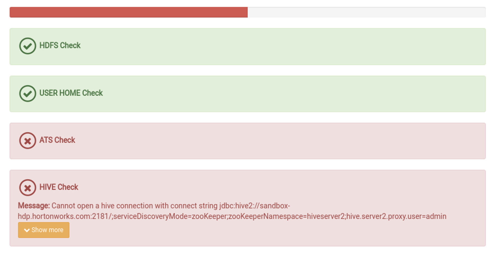

Après un long message sur Teams pour expliquer à monsieur Behfar le problème, ce dernier lui a répondu que “il est possible que l’installation de MySQL ait provoqué des changements faisant que Hive ne fonctionnait plus” (alors que l’installation de MySQL était dans le README de l’exemple Twitter). Pour remédier à cela, il a fourni une nouvelle VM Azure, mais il fallait donc tout recommencer. 

## 2ème essai : **Twitter example**

Pour ce deuxième essai sur une nouvelle VM, Florent a suivi de nouveau les étapes sans celle qui avait causé des problèmes la dernière fois, soit l’installation de MySQL.

Il a pu correctement installer `maven`, build Flume depuis les fichiers fournis et modifier la configuration de ce dernier.

### Hive

Pour Hive, le build s’est déroulé sans problème également, mais lors de la création de la table nécessaire, `tweets`, il y a eu plusieurs problèmes par rapport à la commande de création de table, les lignes problématique ont donc été enlevées. Ce sont les suivantes :

```sql
ADD JAR <jar-path>; // NullPointerException
user:STRUCT<
		 screen_name:STRING,
		 name:STRING>, // ParseException line 8:5 Failed to recognize predicate 'user'
user STRUCT<
     screen_name:STRING,
     name:STRING,
     friends_count:INT,
     followers_count:INT,
     statuses_count:INT,
     verified:BOOLEAN,
     utc_offset:INT,
     time_zone:STRING>, // ParseException line 14:3 Failed to recognize predicate 'user'
ROW FORMAT SERDE 'com.cloudera.hive.serde.JSONSerDe' // Cannot validate serde: com.cloudera.hive.serde.JSONSerDe
```

### Oozie

La dernière partie fut de préparer Oozie. J’ai suivi les étapes sans trop de difficultés (en sautant celles incluant MySQL, par conséquent). La dernière étape fut de lancer le workflow, avec la commande suivante :

```bash
oozie job -oozie http://<oozie-host>:11000/oozie -config oozie-workflows/job.properties -run
```

L’erreur que j’ai eu fut la suivante :

```bash
java.net.UnknownHostException: hadoop1
```

J’ai modifié dans le fichier `oozie-workflows/job.properties` la variable `nameNode` pour avoir le correct nom de noeud et j’ai eu le message suivant :

```bash
job: 0000000-221214140939391-oozie-oozi-C
```

À ce stade, je me suis dit que je pourrais donc afficher les tweets récupérés dans la table, mais Hive n’arrive pas à l’afficher :


Après avoir fait un query pour afficher les tweets, on peut constater qu’il n’y a rien dans la table, et que donc l’exemple n’a pas fonctionné :

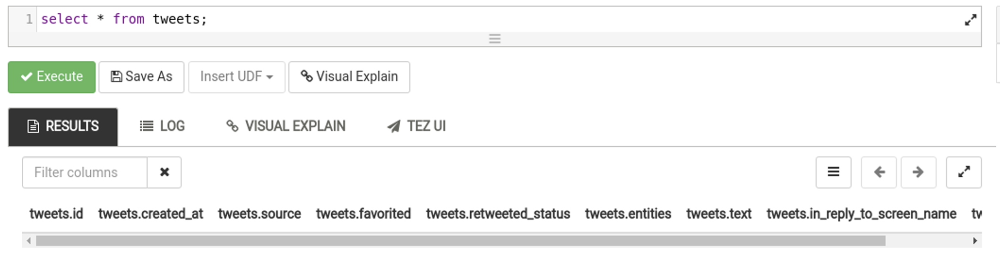

## 3ème essai : import d’un CSV dans Hive

Florent a suivi le [tutoriel suivant](https://ittutorial.org/big-data-import-csv-to-hive/) afin d’essayer d’importer un fichier `.csv` dans une table de la base de données Hive. 

Pour commencer, il a téléchargé un fichier `.csv` depuis les données qu’on veut utiliser, soit [Data Police UK](https://data.police.uk/data/). Pour ce 1er essai, il a uniquement pris les données du mois de janvier 2020 de la force de police de Londres. Ensuite, il l’a nettoyé afin d’avoir des noms de colonnes respectant la convention “snake case” et il a enlevé les lignes qui n’avait pas d’ID de crime. Il l’a ensuite upload sur la VM depuis FileZilla. C’est à ce moment qu’il a constaté qu’il y avait un nouveau dossier, qu’il n’avait pas créé, nommé `kafka-weather-map`. Après discussion avec David, ils se sont rendus compte qu’un autre groupe travaillait également sur la même VM. Il faut donc faire attention si les besoin de configuration des différents éléments de Cloudera ne sont pas les mêmes en fonction des besoins des groupes.

Ensuite, il a créé la table dans Hive avec le query suivant :

```sql
CREATE EXTERNAL TABLE crimes (
    crime_id string,
    month date,
    reported_by string,
    falls_within string,
    longitude double,
    latitude double,
    location string,
    lsoa_code string,
    lsoa_name string,
    crime_type string,
    last_outcome_category string
)
ROW FORMAT DELIMITED
FIELDS TERMINATED BY ','
STORED AS TEXTFILE;
```

Il s’est basé sur les données dans le fichier `.csv` pour définir le type de données des champs et il s’est aidé de [ce site](https://understandingbigdata.com/hive-data-types/) pour connaître les différents types disponibles.

À cette étape, il a voulu importer le fichier `.csv`, il l’a donc upload sur Ambari, dans le dossier `data`, comme on peut le voir sur la capture d’écran suivante :

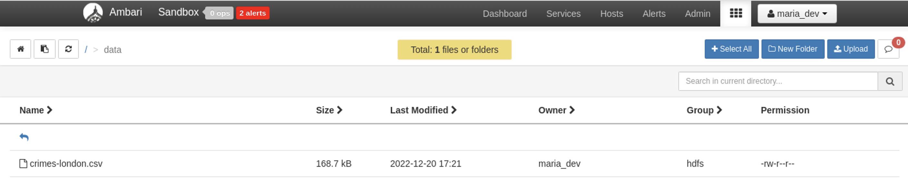

Ensuite, il a exécuté la commande suivante, sensée importer le fichier `.csv` dans la table nouvellement créée : 

```sql
load data local inpath "/data/crimes-london.csv" overwrite into table crimes;
```

Cependant, il n’a eu que l’erreur suivante :

```sql
SemanticException Line 1:23 Invalid path '"/data/crimes-london.csv"': No files matching path file:/data/crimes-london.csv
```

Pour contrer cette erreur, il a [cherché sur Internet](https://sparkbyexamples.com/apache-hive/hive-load-csv-file-into-table/) et exécuté la commande suivante, en utilisant un chemin absolu au lieu de relatif :

```sql
load data inpath "hdfs://sandbox-hdp.hortonworks.com:8020/data/crimes-london.csv" overwrite into table crimes;
```

On peut voir que l’import a correctement fonctionné :

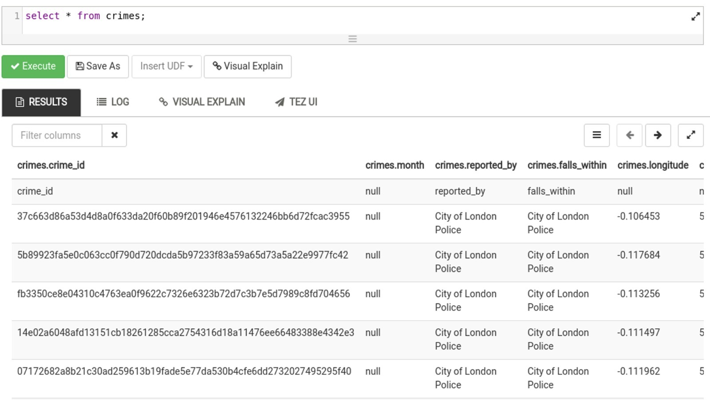

Cepandant, comme dit précédemment, c'était uniquement les données du mois de janvier 2020 de la force de police de Londres. Pour la suite, il va essayer de faire avec plus de données, c'est-à-dire du début 2020 jusqu'à octobre 2022 (qui sont les données les plus récentes disponible à ce moment).

### Suite : 2020-2022

Pour ce faire, Florent a donc téléchargé les données de tous les commissariats disponibles, de 2020 jusqu'à octobre 2022. Cependant, la structure des .csv téléchargés étaient comme suit :

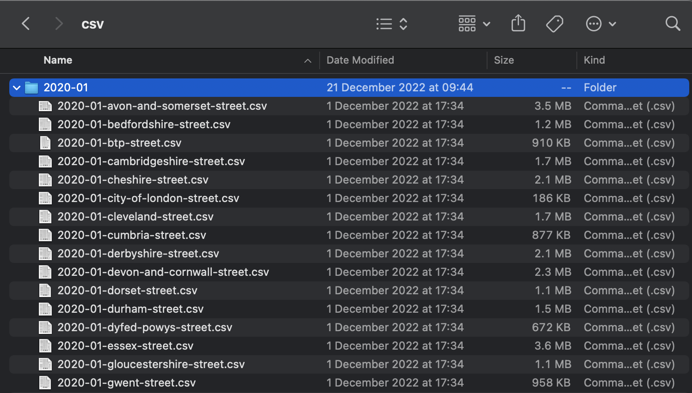

Il y a 1 dossier pour chaque mois, et 1 fichier .csv pour chaque commissariat. Florent a donc créé un script Python (`merge_csv.py`) permettant de fusionner tous les .csv dans un seul fichier csv, afin de pouvoir l'importer dans Hive. 

Ceci fait, il l'a transféré sur la VM Azure et importé tant bien que mal dans HDFS (l'importation n'avançait pas ou plantait à plusieurs reprises). Ensuite, il a pu recréer la table `crimes` (cette fois avec le mois stocké en tant que `string`, parce qu'il y avait des problèmes si le mois était stocké en `date`) et importer les données du .csv dedans. Pour vérifier que l'importation avait réussi, il a effectué un `count` :

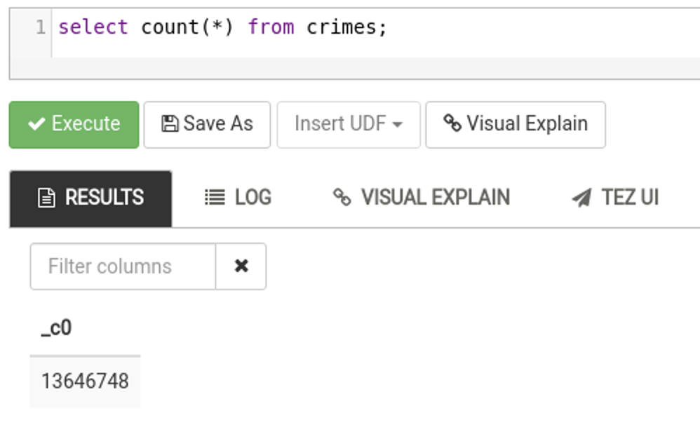

On peut voir qu'il y a 13'646'748 de lignes.

### Zeppelin

Ensuite, Florent a créé un notebook Zeppelin pour faire des graphiques avec les données. Le notebook est disponible sous le nom de `crime_analysis.json`.

#### Statistiques pour les crimes de type "bicycle theft"

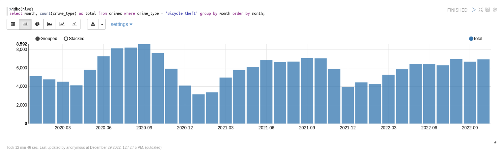

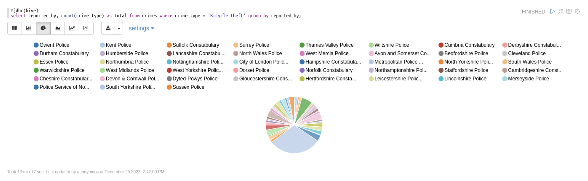

#### Statistiques pour le commissariat "Avon and Somerset Constabulary"

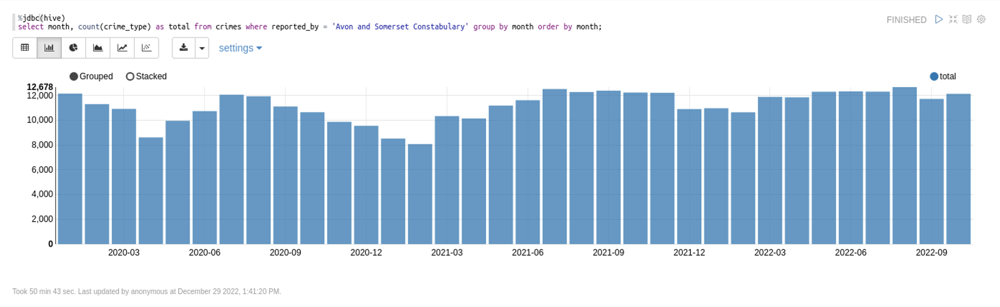

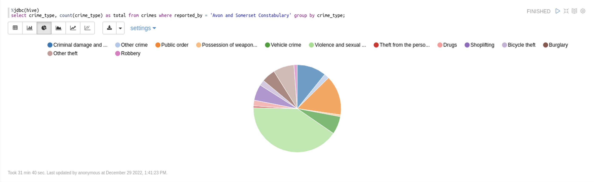

## Solution alternative

Pour pouvoir avoir quelque chose à montrer lors de la présentation et ne pas avoir à faire uniquement une présentation des problèmes rencontrés, David et Florent ont fait des recherches pour savoir si le projet était faisable avec d’autres technologies émergentes. Ces recherches et l’implémentation de cette solution ont été faites en parallèle de l’installation de HDP et de l’essai de faire fonctionner l’exemple Twitter sur la VM Azure. 

Après plusieurs recherches approfondies et minutieuses, David a découvert de nombreuses technologies qui peuvent l'aider à atteindre ses objectifs. Parmi elles, Grafana, qui est un outil puissant permettant de représenter visuellement des données sous forme de graphiques, ainsi qu'ElasticSearch, une base de données NoSQL très populaire et régulièrement mentionnée par M. Behfar dans le cadre de ses cours.

Ces deux technologies sont clairement cohérentes dans le contexte du module, car elles sont entièrement basées sur des technologies émergentes qui fonctionnent de manière optimale dans un système distribué. En outre, elles sont parfaitement complémentaires et se connectent très bien entre elles.

L’avantage de ces outils par rapport à HDP est qu’ils peuvent être facilement installés et utilisés sur des machines personnelles, sans avoir besoin d’une puissance de calcul élevée. En outre, ces outils sont très flexibles et peuvent être adaptés à des environnements variés et à des applications variées. De plus, ils sont également très faciles à utiliser et à maintenir, ce qui signifie que vous n'aurez pas besoin de consacrer beaucoup de temps ou de ressources à leur installation et à leur utilisation.

### Objectifs de cette solution

Il y a plusieurs objectifs pour faire fonctionner cette solution :

- Faire fonctionner les outils
- Importer les données dans la base de données ElasticSearch
- Utiliser les données d’ElasticSearch dans Grafana

### Faire fonctionner les outils

**ElasticSearch**

Pour importer les données dans ElasticSearch, il faut d’abord que le service ElasticSearch soit démarré. Pour ce faire, il suffit de se rendre dans le dossier ElasticSearch téléchargé préalablement et de lancer le fichier `elasticsearch.sh` via le terminal. Lors du premier lancement, ElasticSearch va générer des mots de passes pour les différents utilisateurs par défaut. Dans notre cas, nous allons utiliser le superutilisateur nommé `elastic` pour faciliter la mise en place de la solution de manière rapide. Il faut donc mémoriser le mot de passe de l’utilisateur `elastic`

Ensuite, il faut se rendre sur l’adresse `http://localhost:9200`. Il nous est demandé les identifiants de connexion et c’est ici que l’on indiquera l’utilisateur `elastic` et le mot de passe généré préalablement.

Si tout se passe bien, ce retour en JSON apparaît :

```json
{
  "name": "MacBook-Air-de-David.local",
  "cluster_name": "elasticsearch",
  "cluster_uuid": "NK4ST6KNTn20qCENXw6iAw",
  "version": {
    "number": "8.5.3",
    "build_flavor": "default",
    "build_type": "tar",
    "build_hash": "4ed5ee9afac63de92ec98f404ccbed7d3ba9584e",
    "build_date": "2022-12-05T18:22:22.226119656Z",
    "build_snapshot": false,
    "lucene_version": "9.4.2",
    "minimum_wire_compatibility_version": "7.17.0",
    "minimum_index_compatibility_version": "7.0.0"
  },
  "tagline": "You Know, for Search"
}
```

**Grafana**

Concernant Grafana, après l’avoir installé via Homebrew ou n’importe quel gestionnaire de paquets Unix, il suffit de lancer le service via `brew service start grafana`. 

Ensuite, on peut accéder à l’interface Grafana depuis `http://localhost:3000`.

### Importer les données dans la base de données ElasticSearch

Pour importer ces données, il a fallu créer un script qui appelle l’API et qui insère les données dans ElasticSearch. Cela nous a demandé plusieurs heures de travail, mais nous avons finalement réussi à le mettre en place et à le faire fonctionner correctement. Il nous semble important de préciser que la seule contrainte du côté de l’API est le nombre d’appels qui sont limités à 15 par seconde. Pour éviter tout problème, nous avons été très prudent et nous nous sommes assurés de ne pas effectuer plus de 15 appels à l'API par seconde. Nous avons vérifié en permanence que le script fonctionnait correctement et que nous ne dépassions pas le nombre d'appels autorisés.

Il est également important de savoir quelles sont les données dont nous avons besoin pour ce projet. On cherche à avoir les crimes avec les commissariats. Et il nous faut aussi des données suffisamment anciennes pour pouvoir observer la temporalité des données.

Il faut donc utiliser deux endpoints :

- [La liste des commissariats](https://data.police.uk/docs/method/forces/)
- [Les crimes en fonction des commissariats et de la date](https://data.police.uk/docs/method/crimes-no-location/)

Avec ces deux endpoints, on peut récupérer tous les crimes pour tout les commissariats et dans un interval de temps spécifique.

Pour augmenter la rapidité d’importation, il est préférable d’utiliser de l’asynchrone pour faire plusieurs appels en “simultané” et optimiser le temps pris pour l’importation des données.

**Aperçu du script Python**

```python
from elasticsearch import AsyncElasticsearch
import requests
import asyncio
import aiohttp
import json
import constants
from datetime import date
import pandas as pd

async def get_data(data_force_id: str, es: AsyncElasticsearch, date: date):
    async with aiohttp.ClientSession() as session:
        async with session.get(f"https://data.police.uk/api/crimes-no-location?force={data_force_id}&date={date}") as response:
            data = await response.read()  # Read the response
            data = json.loads(data)  # Convert the response to a JSON object

            for crime in data:
                # Insert the force id in the each element of the list
                crime['force'] = data_force_id
                # Insert the data in Elasticsearch
                await es.index(index=constants.INDEX_NAME, body=crime)
            return data

async def main():
    # Create an Elasticsearch client
    es = AsyncElasticsearch("http://localhost:9200",
                            api_key=("elastic", "password"))

    # Getting the data from forces from Police UK API
    data_forces = requests.get("https://data.police.uk/api/forces").json()
    # Getting the data from crimes without location from Police UK API
    print("Got the forces !")

    # Create a list of tasks
    tasks = []
    print("Creating tasks...")
    task_count = 1
		# Range of date based on the constants
    date_range = pd.date_range(
        start=constants.START_DATE, end=constants.END_DATE, freq="MS")
    for date in date_range:
				# Format to be good for API
        date_month = date.strftime("%Y-%m")
        for force in data_forces:
            # Add a task to the list of tasks using asyncio
            tasks.append(asyncio.create_task(
                get_data(force['id'], es, date_month)))
            print(f"Tasks created {task_count} !")
            task_count += 1
            await asyncio.sleep(1)

    # Wait for all tasks to complete
    await asyncio.gather(*tasks)

    await es.close()

if __name__ == "__main__":
    asyncio.run(main())
```

On peut donc voir que le script utilise de l’asynchrone. On appelle d’abord la liste des commissariats. Ensuite, on crée une liste de coroutines utilisé pour stocker chacun des appels et attendre que tout les appels aient fini pour s’assurer que le script soit fini. En ce qui concerne l’interval de temps, on utilise pandas qui se charge de créer une liste de date entre une date de début et de fin.

Il ne faut pas oublier de mettre un temps d’arrêt avec `asyncio.sleep(1)` pour éviter de surcharger l’API d’appels.

Et pour chaque appel, on insère le résultat dans ElasticSearch. Voilà comment sont importées les données.

### Utiliser les données d’ElasticSearch dans Grafana

**Ajout du data source**

Pour utiliser les données d’ElasticSearch dans Grafana, il faut se diriger dans les paramètres des Data sources pour indiquer un data source ElasticSearch qui gèrera l’index `crimes` (l’index qui contient toutes nos données préalablement importées.

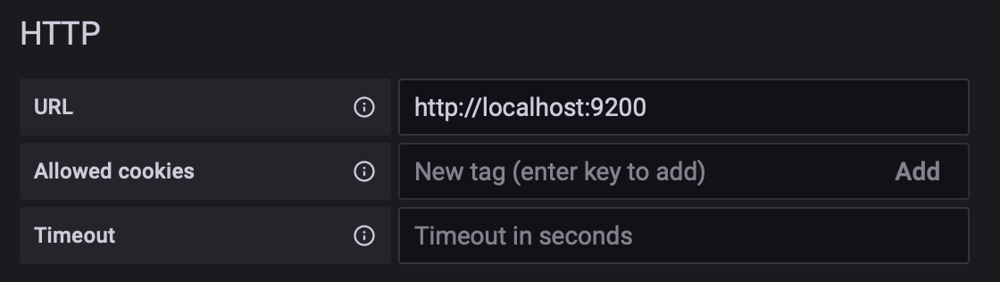

Indication de l’URL de notre cluster ES.

Il ne faut également pas oublier de spécifier les identifiants de connexion à notre cluster ElasticSearch.

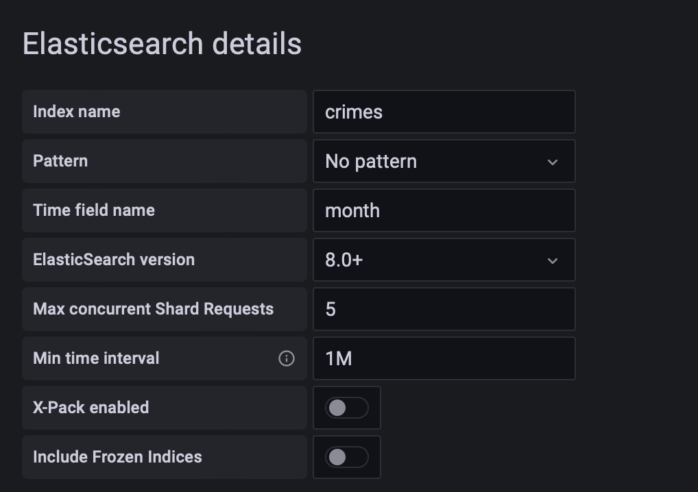

Indication de l’index et du champ qui contient la temporalité des donées. Il ne faut également pas oublier d’indiquer l’interval minimum. 

**Création d’un dashboard**

Un dashboard dans Grafana est un espace qui contient plusieurs graphiques. Pour en créer un, il suffit dans cliquer sur “New” dans l’onglet “Dashboard”. Il est également possible d’importer un dashboard via un JSON.

**Création de variables**

Ensuite, il a fallu créer les variables pour permettre de faire un dashboard d’analyse dynamique. Les variables dans Grafana permettent à l’utilisateur qui visualise les graphiques de filtrer les graphiques. Dans notre cas, on peut filtrer par catégorie de crimes et par commissariat.

Pour créer ces variables, il faut aller dans les réglages du dashboard, sous variable, et de cliquer sur créer

Ici, on a créé une variable pour les commissariats qui fonctionne via une requête à la base de données ElasticSearch. Dans Query options, on peut voir

```json
{"find" : "terms", "field" : "force.keyword"}
```

C’est la query utilisée pour récupérer tout les commissariats depuis la base de données. 

On a ensuite la possibilité d’indiquer si la sélection accepte plusieurs valeurs en même temps et si une option “All” est disponible.

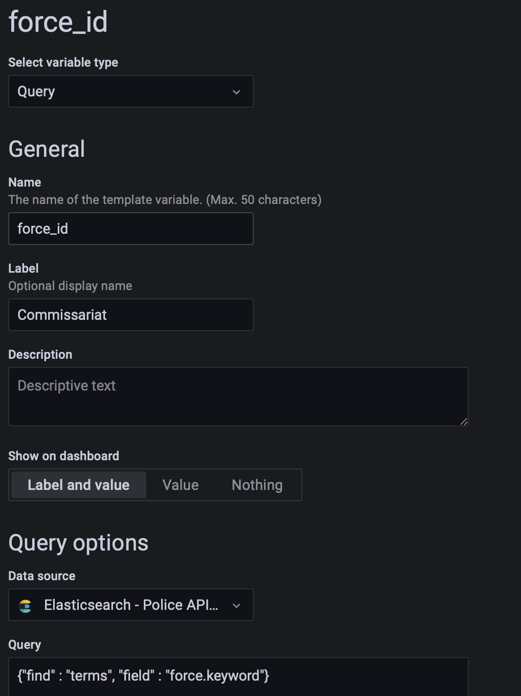


Le dashboard contient maintenant des listes déroulantes qui représentent les variables citées précédemment.

**Création des graphiques**

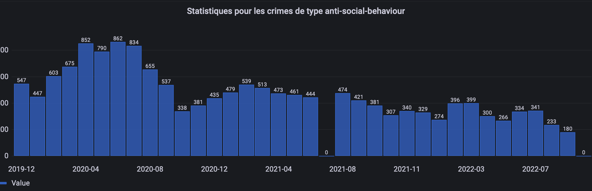

Graphique pour observer le compte de crimes par rapport au type de crime anti-social-behaviour

Pour créer un graphique, il faut utiliser le data source ElasticSearch et préciser les paramètres que l’on souhaite utiliser pour créer ce graphiqu

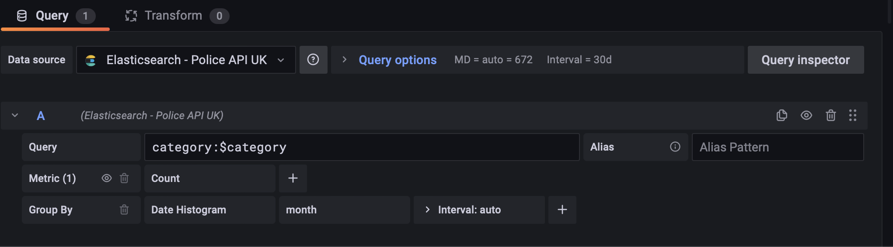

On utilise la variable de la liste déroulante pour filtrer par rapports aux catégories et on afficher sous forme de date histogram.

Cela nous donne donc le graphique que l’on a vu juste au dessus.

Ensuite, on souhaite aussi voir la répartition des commissariats qui se sont chargés de traiter les crimes du même type.

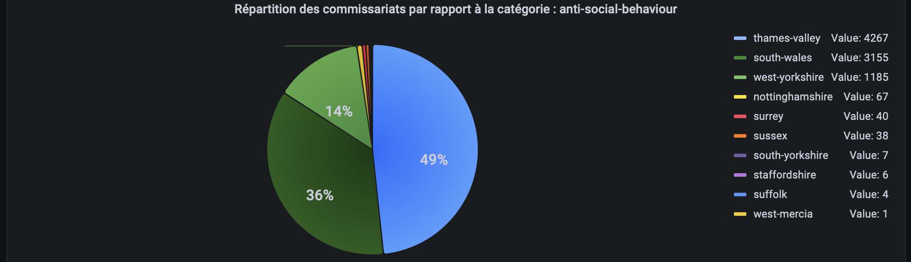

Graphique pour observer la répartition des traitements de crimes des commissariat par rapport au type de crime anti-social-behaviour.


On utilise également la variable de la liste déroulante avec le $category et on regroupe par commissariat. 

On affiche ensuite le diagramme sous forme de Pie Chart et on spécifie dans les paramètres du Pie Chart que l’on souhaite prendre toutes les valeurs de la query. Et on a le résultat attendu par le projet initial.

**JSON du Dashboard**

[Panel JSON for Grafana Dashboard on Police UK API](https://gist.github.com/DavidPlnmr/20e4832431582db5743a549dfe0f7468)

# Conclusion

Au cours de ce projet, nous avons installé la plateforme HDP afin d'analyser les données récupérées depuis l'API des forces de police britanniques. Nous avons rencontré des difficultés pour faire fonctionner le cluster HDP, mais avons trouvé une solution alternative en nous appuyant sur Grafana et ElasticSearch. En fin de compte, nous avons pu créer un dashboard qui offre une visualisation des données et qui permet à l'utilisateur de faire des filtres par type de crime et par commissariat.

# Bibliographie

[Police API Documentation](https://data.police.uk/docs/)

[GitHub - cloudera/cdh-twitter-example: Example application for analyzing Twitter data using CDH - Flume, Oozie, Hive](https://github.com/cloudera/cdh-twitter-example)

[Installing Cloudera VM in M1 Mac](https://community.cloudera.com/t5/Support-Questions/Installing-Cloudera-VM-in-M1-Mac/m-p/322909)

[Big Data - Import .csv to Hive - IT Tutorial](https://ittutorial.org/big-data-import-csv-to-hive/)